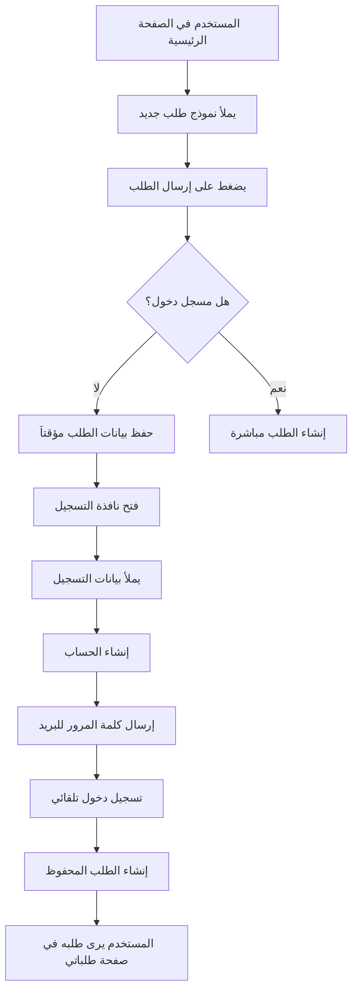
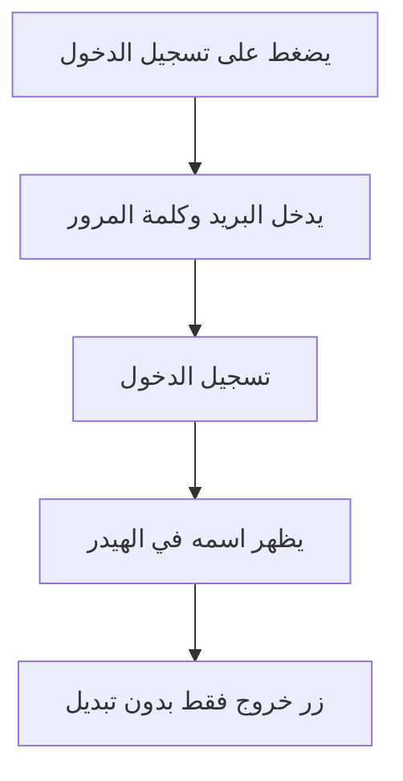

# نظام المصادقة والتسجيل - التحديثات

## التحديثات المنفذة

### 1. ✅ حفظ الطلب أثناء التسجيل
**المشكلة:** عندما يضيف العميل طلب وهو غير مسجل، كان الطلب يضيع بعد التسجيل.

**الحل:**
- إضافة `pendingRequest` state لحفظ بيانات الطلب مؤقتاً
- عند محاولة إضافة طلب بدون تسجيل دخول، يتم:
  1. حفظ بيانات الطلب في `pendingRequest`
  2. فتح نافذة التسجيل مباشرة
  3. بعد إتمام التسجيل والدخول، يتم إنشاء الطلب تلقائياً
  4. إفراغ `pendingRequest`

**الكود:**
```typescript
// في handleCreateRequest
if (!currentUser) {
  setPendingRequest({ title, description, categoryId, beforeImageUrl, suggestedBudget, region });
  setShowSignupModal(true);
  return;
}

// في handleSignup بعد تسجيل الدخول
if (pendingRequest && role === UserRole.Customer) {
  const authUser = await api.auth.getCurrentUser();
  if (authUser) {
    await api.requests.create({...pendingRequest});
    setPendingRequest(null);
  }
}
```

### 2. ✅ إخفاء زر "تبديل الحساب"
**المشكلة:** كان زر "تبديل" يظهر حتى بعد تسجيل الدخول، وهو غير منطقي في نظام مصادقة حقيقي.

**الحل:**
- إزالة زر "تبديل" من Header عندما يكون المستخدم مسجل دخول
- الإبقاء على زر "خروج" فقط
- عندما لا يكون هناك مستخدم، يظهر زر "تسجيل الدخول"

**قبل:**
```
[المستخدم] [تبديل] [خروج]  ← زر تبديل غير ضروري
```

**بعد:**
```
[المستخدم] [خروج]  ← واضح ومباشر
```

### 3. ✅ إرسال كلمة المرور عبر البريد الإلكتروني
**المشكلة:** عند التسجيل، كانت كلمة المرور تظهر فقط في alert بدون إرسالها للبريد.

**الحل:**
- إنشاء Edge Function باسم `send-password-email`
- استدعاء الدالة بعد إنشاء الحساب مباشرة
- إرسال البيانات: email, password, name

**Edge Function:**
```typescript
// supabase/functions/send-password-email/index.ts
// حالياً: يقوم بطباعة المعلومات في console (للتجربة)
// للإنتاج: يمكن دمجها مع Resend أو SendGrid
```

**استدعاء الدالة:**
```typescript
const supabaseUrl = import.meta.env.VITE_SUPABASE_URL;
const supabaseAnonKey = import.meta.env.VITE_SUPABASE_ANON_KEY;
await fetch(`${supabaseUrl}/functions/v1/send-password-email`, {
  method: 'POST',
  headers: {
    'Content-Type': 'application/json',
    'Authorization': `Bearer ${supabaseAnonKey}`
  },
  body: JSON.stringify({ email, password, name })
});
```

## تدفق المستخدم الجديد

### سيناريو 1: مستخدم جديد يريد إضافة طلب



### سيناريو 2: مستخدم لديه حساب بالفعل



## الملفات المعدلة

### 1. `App.tsx`
- إضافة `pendingRequest` state
- تعديل `handleCreateRequest` لحفظ الطلب قبل التسجيل
- تعديل `handleSignup` لإنشاء الطلب بعد التسجيل
- إضافة استدعاء Edge Function لإرسال كلمة المرور

### 2. `components/Header.tsx`
- إزالة زر "تبديل" عندما يكون المستخدم مسجل دخول
- الإبقاء على زر "خروج" فقط

### 3. `supabase/functions/send-password-email/index.ts` (جديد)
- Edge Function لإرسال كلمة المرور عبر البريد
- جاهز للدمج مع خدمات البريد مثل Resend

## للإنتاج: إعداد البريد الإلكتروني الحقيقي

لتفعيل إرسال البريد الفعلي، قم بالتالي:

### الخطوة 1: اشتراك في خدمة بريد
اختر أحد هذه الخدمات:
- [Resend](https://resend.com) - موصى به، سهل الاستخدام
- [SendGrid](https://sendgrid.com)
- [Mailgun](https://mailgun.com)

### الخطوة 2: احصل على API Key
بعد التسجيل، احصل على API Key من لوحة التحكم

### الخطوة 3: أضف API Key كـ Secret في Supabase
```bash
# في Supabase Dashboard
# Settings > Edge Functions > Secrets
# أضف:
RESEND_API_KEY=re_xxxxxxxxxxxx
```

### الخطوة 4: فعّل الكود في Edge Function
في `send-password-email/index.ts`، قم بإزالة التعليق عن الكود:

```typescript
const RESEND_API_KEY = Deno.env.get('RESEND_API_KEY');
const response = await fetch('https://api.resend.com/emails', {
  method: 'POST',
  headers: {
    'Authorization': `Bearer ${RESEND_API_KEY}`,
    'Content-Type': 'application/json',
  },
  body: JSON.stringify({
    from: 'سوق الخدمات <noreply@yourdomain.com>',
    to: email,
    subject: 'مرحباً بك في سوق الخدمات',
    html: `
      <div dir="rtl">
        <h2>مرحباً ${name}!</h2>
        <p>تم إنشاء حسابك بنجاح في سوق الخدمات.</p>
        <p>بيانات الدخول الخاصة بك:</p>
        <ul>
          <li>البريد الإلكتروني: <strong>${email}</strong></li>
          <li>كلمة المرور: <strong>${password}</strong></li>
        </ul>
        <p>يرجى الاحتفاظ بهذه المعلومات في مكان آمن.</p>
      </div>
    `
  }),
});
```

## ملاحظات أمنية

1. **كلمات المرور**: في بيئة الإنتاج، يُفضل إرسال رابط لإعادة تعيين كلمة المرور بدلاً من إرساله نصياً
2. **HTTPS**: تأكد من استخدام HTTPS في جميع الاتصالات
3. **تشفير البريد**: استخدم خدمات بريد موثوقة مثل Resend التي تدعم TLS
4. **Rate Limiting**: قم بتفعيل Rate Limiting على Edge Function لمنع الإساءة

## الاختبار

### اختبار التدفق الكامل:
1. افتح الصفحة الرئيسية بدون تسجيل دخول
2. أضف طلب جديد
3. اضغط "إرسال الطلب"
4. ✅ يجب أن تفتح نافذة التسجيل
5. املأ بيانات التسجيل
6. ✅ يجب أن يتم تسجيل الدخول تلقائياً
7. ✅ يجب أن يظهر الطلب في "طلباتي"
8. ✅ لا يظهر زر "تبديل" في الهيدر
9. ✅ يظهر alert مع معلومات تسجيل الدخول

### اختبار البريد الإلكتروني:
1. افتح Console في Developer Tools
2. سجل حساب جديد
3. ✅ يجب أن ترى في Console:
   ```
   Would send email to: user@example.com
   Password: xxxxxx
   Name: اسم المستخدم
   ```

## الخلاصة

تم تحسين تجربة المستخدم بشكل كبير:
- ✅ الطلبات لا تضيع أثناء التسجيل
- ✅ واجهة مستخدم أنظف بدون أزرار غير ضرورية
- ✅ نظام إرسال كلمة المرور جاهز (محاكاة حالياً، جاهز للإنتاج)
- ✅ تدفق سلس ومنطقي من البداية للنهاية
